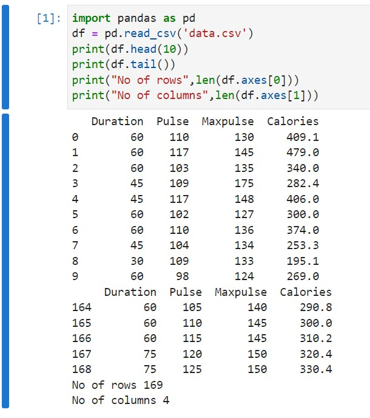

# Read-from-CSV

## AIM:

## ALGORITHM:
### Step 1:
start python
### Step 2:
import pandas
### Step 3:
the number of rows returned is defined in pandas option settins
### Step 4:
read the contents of the CSV file using the df.read function.
### Step 5:
increase the maximum number of rows to display the entire dataframe.

## PROGRAM:
~~~
import pandas as pd
df = pd.read_csv('data.csv')
print(df.head(10))
print(df.tail())
print("No of rows",len(df.axes[0]))
print("No of columns",len(df.axes[1]))
~~~

## OUTPUT:

## RESULT:
